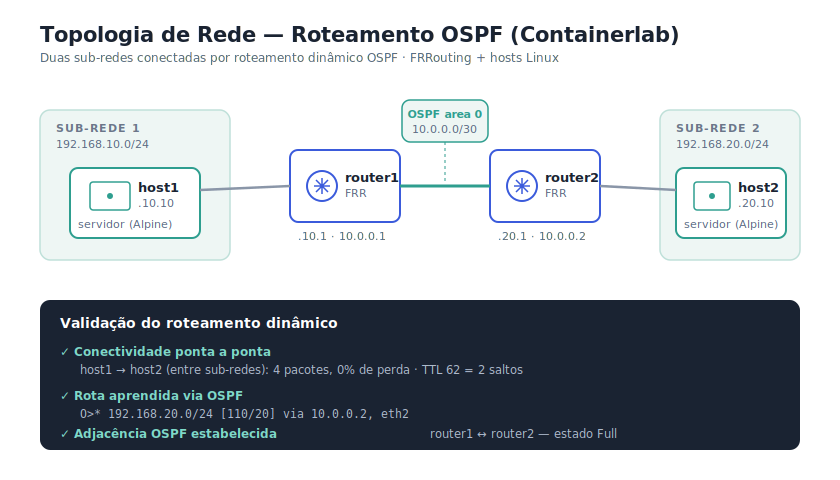

# Camada 1 — Topologia de Rede com Roteamento OSPF

> Topologia de rede corporativa definida como código (**IaC**) usando **Containerlab**, com roteamento dinâmico **OSPF** entre dois roteadores FRRouting conectando duas sub-redes distintas.

Parte do projeto **NOC Lab** — esta é a **Camada de Rede**, que fornece a infraestrutura monitorada pela [stack de monitoramento](../README.md) (Zabbix + Prometheus + Grafana).



---

## 🎯 Objetivo

Demonstrar a configuração e validação de uma rede roteada: duas sub-redes que não se enxergam diretamente, conectadas por roteamento dinâmico OSPF. Cobre fundamentos de **CCNA** (endereçamento, roteamento, verificação) num ambiente reproduzível e versionável.

---

## 🧰 Stack

| Ferramenta | Função |
|-----------|--------|
| **Containerlab** | Orquestração da topologia (infraestrutura como código) |
| **FRRouting (FRR)** | Roteadores com OSPF — CLI compatível com Cisco IOS |
| **Alpine Linux** | Hosts (simulam servidores nas sub-redes) |
| **Docker** | Runtime dos nós |

---

## 🗺️ Topologia

```
host1 ──── router1 ════[OSPF]════ router2 ──── host2
192.168.10.10   10.0.0.1   10.0.0.2   192.168.20.10
   │         192.168.10.1      192.168.20.1      │
 SUB-REDE 1                            SUB-REDE 2
```

| Nó | IP(s) | Função |
|----|-------|--------|
| router1 | eth1: 192.168.10.1/24 · eth2: 10.0.0.1/30 | Roteador FRR (OSPF) |
| router2 | eth1: 192.168.20.1/24 · eth2: 10.0.0.2/30 | Roteador FRR (OSPF) |
| host1 | 192.168.10.10/24 | Servidor — sub-rede 1 |
| host2 | 192.168.20.10/24 | Servidor — sub-rede 2 |

O link entre os roteadores (10.0.0.0/30) é a rede de trânsito onde o OSPF troca informações de roteamento.

---

## 🚀 Como executar

Pré-requisitos: WSL2 com Ubuntu, Docker Engine nativo e Containerlab instalados.

```bash
containerlab deploy -t noc-lab.clab.yml
```

### Configurar OSPF (em cada roteador)

```bash
docker exec -it clab-noc-lab-router1 vtysh
```
```
configure terminal
router ospf
 network 192.168.10.0/24 area 0
 network 10.0.0.0/30 area 0
exit
exit
write memory
```

No router2, repetir trocando a rede local para `192.168.20.0/24`.

---

## ✅ Validação

### 1. Conectividade entre sub-redes
```bash
docker exec -it clab-noc-lab-host1 ping -c 4 192.168.20.10
```
Resultado: **0% de perda**, TTL 62 (2 saltos — confirma o roteamento pelos dois roteadores).


### 2. Rota aprendida via OSPF
```bash
docker exec -it clab-noc-lab-router1 vtysh -c "show ip route ospf"
```
A rota `O>* 192.168.20.0/24 [110/20] via 10.0.0.2` mostra que o router1 **aprendeu** o caminho para a sub-rede remota dinamicamente (código `O` = OSPF), sem rota estática.


### 3. Adjacência OSPF
```bash
docker exec -it clab-noc-lab-router1 vtysh -c "show ip ospf neighbor"
```
O vizinho aparece em estado **Full**, confirmando que os roteadores sincronizaram suas bases de dados OSPF.


---

## 🧠 Contexto NOC / CCNA

A CLI do FRR (`vtysh`) é praticamente idêntica à do Cisco IOS — `configure terminal`, `router ospf`, `network ... area 0`, `write memory`. Os mesmos conceitos e comandos de um roteador Cisco real, num lab reproduzível e versionável.

Para um analista de NOC, este lab exercita o núcleo do troubleshooting de rede: entender o caminho que o tráfego percorre, verificar adjacências de roteamento e confirmar conectividade fim-a-fim.

---

## 🧹 Tear down

```bash
containerlab destroy -t noc-lab.clab.yml --cleanup
```

---

## 🔜 Integração (próximo passo)

Adicionar `node-exporter` aos hosts e conectar à stack de monitoramento (Camada 2) para que Prometheus/Grafana monitorem esta rede, e o Zabbix acompanhe os roteadores via SNMP.

---

## 👤 Autor

**Raphael Mendes** — Analista de NOC | Infraestrutura → Cibersegurança
[LinkedIn](https://linkedin.com/in/raphael-mendess) · [GitHub](https://github.com/raphaelmendes1234)
